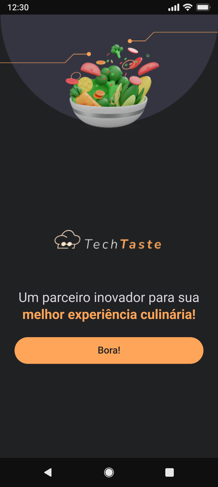

# Delivery App | Imersão Flutter Alura

_[Read it in English](#English)_

Este **Delivery App** é o projeto proposto pela Imersão Mobile da [Alura](https://www.alura.com.br). Trata-se apenas da parte visual da aplicação, sem envolver conexão com banco de dados e/ou publicação em lojas de aplicativos.

O objetivo principal da imersão é dar os primeiros passos em [Flutter](https://flutter.dev/) um framework mobile híbrido que permite o desenvolvimento para diferentes sistemas mobile ou web.

As tecnologias e linguagens utilizadas nesse desafio foram:

  
  

<!-- prettier-ignore -->
| 🪧 Vitrine Dev |  |
| ------------- | - |
| ✨ Nome       | **Flutter Delivery App** - Imersão Mobile Alura |
| 🏷️ Tecnologias | Flutter, Dart |
| 🚀 URL         | N/A |
| 🔥 Desafio     | [**Design no Figma**](https://www.figma.com/design/8EjHjF66roh9kS3wh08C0V/TechTaste-%7C-Imers%C3%A3o--Copy-?node-id=7-47&p=f&t=rwwjkMFQeXgs9Ilg-0) |

  

_English version_

## 🔎 Overview

This **Delivery App** is the project proposed by [Alura](https://www.alura.com.br)'s Mobile Immersion. It only involves the visual part of the application, without involving a connection to a database and/or publishing in app stores.

The main objective of the immersion is to take the first steps in [Flutter](https://flutter.dev/) a hybrid mobile framework that allows development for different mobile or web systems.

The technologies and languages ​​used in this challenge were:

  
  

###

<a href='#top'>🔼 Back to top</a>

---

Developed with 🧡 by [@sucodelarangela 🍊](https://angelacaldas.netlify.app)
